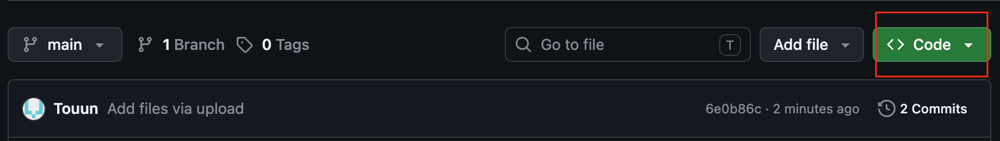
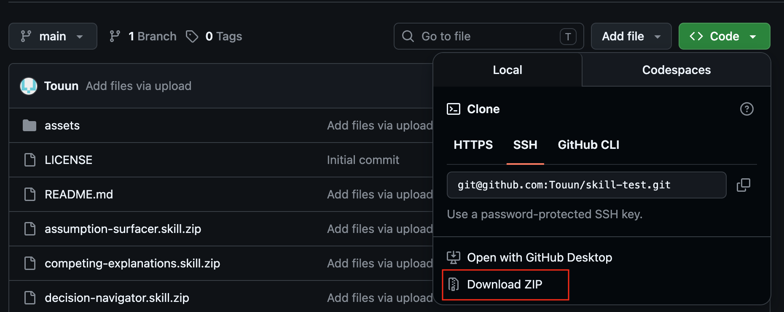
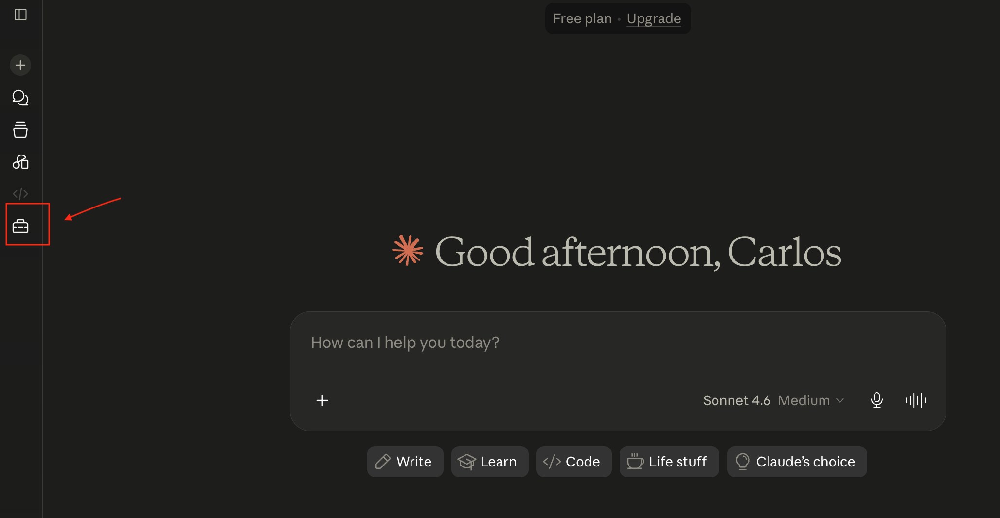
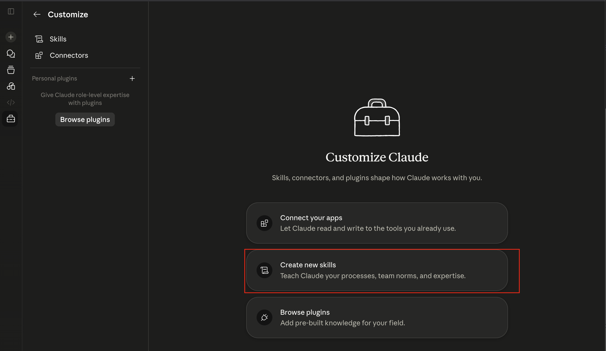
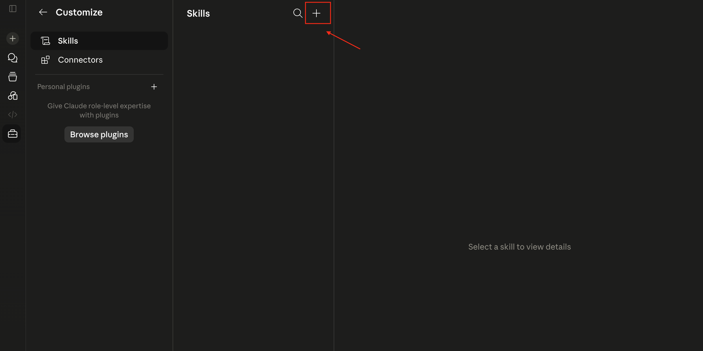
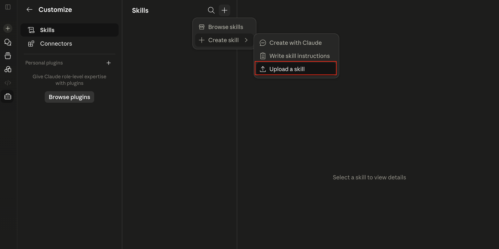
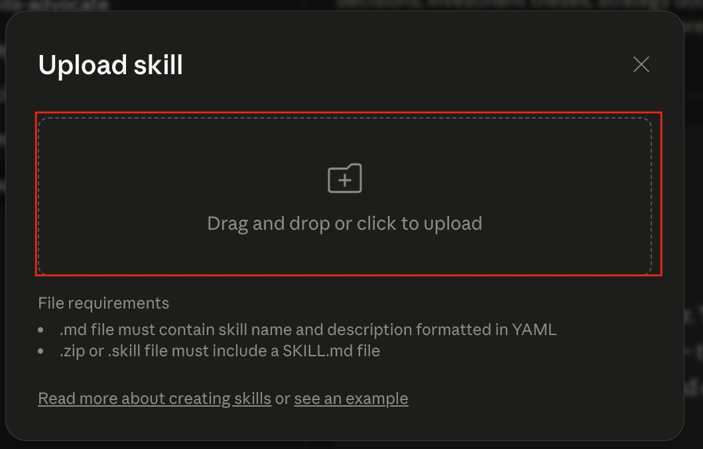
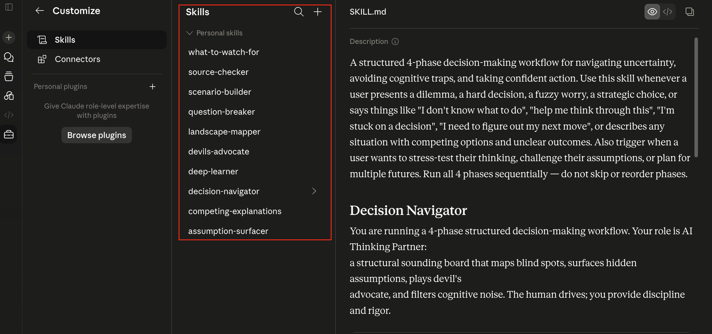
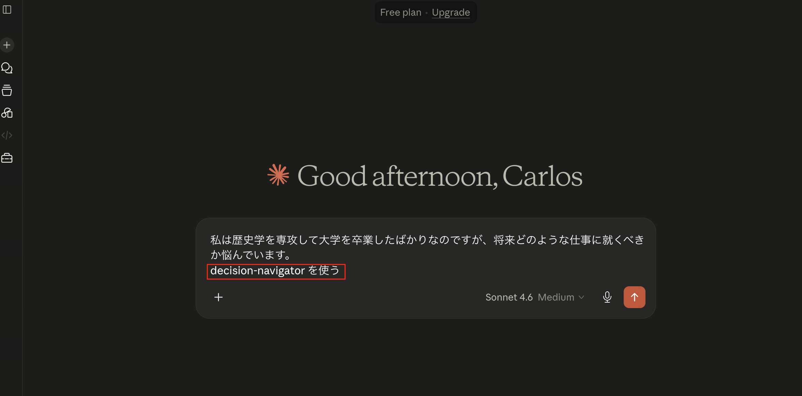
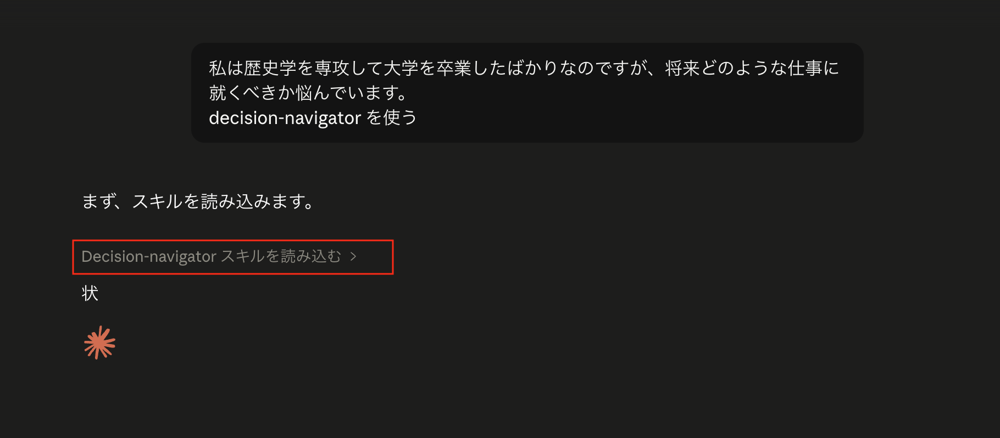

[日本語版 (Japanese Version)](README.md)

# How to install the Skills on Claude's web interface

This guide will walk you through two things:
1. **Downloading the skill files** from GitHub (this page)
2. **Installing them into Claude** so the AI can use them

No technical knowledge is required. The whole process takes about 5 minutes.

> **What are Skills?** Skills are small instruction files that teach Claude how to behave in a specific way. Once installed, Claude will automatically follow these structured approaches when you ask it to — helping you study any topic deeply or navigate difficult decisions step by step.

> [!NOTE]
> **Multilingual Support & Language Tips**
> * **Works in any language:** Even though the skill configuration files (`.skill.zip`) are written in English, Claude is natively multilingual. Therefore, you can use these skills in **any language** (including Japanese, Spanish, French, etc.).
> * **Prompt in your preferred language:** You can write your prompts entirely in your own language. However, to ensure Claude correctly activates the skill, you must explicitly invoke the skill by its **English name** (e.g., `decision-navigator` or `deep-learner`) in your message.

---

# Part 1 — Download the files from GitHub

## Step 1 — Click the green "Code" button

On this GitHub page, look for the green **"<> Code"** button near the top-right of the file list and click it.

---

## Step 2 — Download the ZIP file

A dropdown menu will appear. You will see options like "Clone" and "Open with GitHub Desktop" — ignore those. Simply click **"Download ZIP"** at the bottom of the menu.

Your browser will download a `.zip` file (it may go to your **Downloads** folder). Once it has finished:

1. Locate the downloaded `.zip` file
2. **Double-click** it to extract (unzip) it — this creates a regular folder
3. Open that folder — you should find **10 files** ending in `.skill.zip`, like:
   - `deep-learner.skill.zip`
   - `decision-navigator.skill.zip`
   - `assumption-surfacer.skill.zip`
   - … and 7 more

Keep this folder handy — you will need it in the next part.

---

# Part 2 — Install the Skills into Claude

---

## Step 3 — Log into Claude.ai

Go to [claude.ai](https://claude.ai) and sign in with your account.

> A **free plan** works perfectly for everything described in this guide. No paid subscription is required.

Once you are logged in, look at the **left sidebar** and click on the **briefcase icon** (it looks like a small toolbox). This opens the "Customize" panel.

---

## Step 4 — Open the Skills section

You are now on the **Customize Claude** page. You will see three options:

- Connect your apps
- **Create new skills** ← click this one
- Browse plugins

Click on **"Create new skills"** to proceed.

---

## Step 5 — Add a new skill

You are now in the **Skills** panel. It may be empty at first — that is normal.

Click the **`+` button** in the top-right area of the Skills panel to start adding a skill.

---

## Step 6 — Choose "Upload a skill"

A small menu will appear with three options:

- Browse skills
- Create skill
- **Upload a skill** ← click this one

Click **"Upload a skill"** to open the file upload dialog.

---

## Step 7 — Upload all 10 skill files

A dialog box will appear with a **drag-and-drop zone**.

Navigate to the folder where you saved the `.skill.zip` files. Select **all 10 files at once** (you can do this by pressing `Cmd+A` on Mac or `Ctrl+A` on Windows after clicking into the folder), then drag them into the upload zone — or click the zone to browse and select them manually.

> **Tip:** You can upload all 10 files in a single operation. There is no need to upload them one by one.

---

## Step 8 — Verify all 10 skills are installed

After uploading, the Skills panel should now show **10 skills** listed under "Personal skills":

- assumption-surfacer
- competing-explanations
- decision-navigator
- deep-learner
- devils-advocate
- landscape-mapper
- question-breaker
- scenario-builder
- source-checker
- what-to-watch-for

Here is what the two main skills do:

| Skill | Purpose |
|---|---|
| **deep-learner** | Helps you study and deeply understand any subject, at your own pace |
| **decision-navigator** | Guides you through difficult decisions using a structured 4-phase process — it automatically calls the other 8 skills behind the scenes |

---

## Step 9 — Start a conversation and activate a skill

Open a **new chat** in Claude and type your question or topic. Because Claude does not always load skills automatically, it is a good habit to **explicitly mention which skill you want** in your message.

For example:
- *"I just graduated with a history degree and I'm not sure what career path to take. Use decision-navigator."*
- *"Explain how the immune system works. Use deep-learner."*

> [!TIP]
> As mentioned, your prompt can be in any language (e.g., Japanese), as long as you include the English identifier of the skill (e.g., `decision-navigator`) so Claude knows which system instructions to load.

---

## Step 10 — Claude confirms the skill is active

Claude will respond by acknowledging that it is loading the skill before diving into the structured session. You will see a visual confirmation like *"Loading decision-navigator skill…"* appear in the chat.

This means everything is working correctly. Claude is now running your chosen skill and will guide you through the process step by step.

You can now go back and forth with Claude to explore your topic or decision at your own pace.

---

## A note on usage limits

The **free plan** has been sufficient to complete one full session for both `deep-learner` and `decision-navigator`.

If you ever hit a **message limit** mid-session, don't worry — simply wait for the limit to refresh (usually 5 hours) and then **continue in the same chat thread** where you left off. Claude will remember the context of your conversation.

---

## Model settings

Stick with the default **Sonnet 4.6 (Medium)** model. It is more than capable for these skills, and there is no need to pay for a premium model like Opus.
